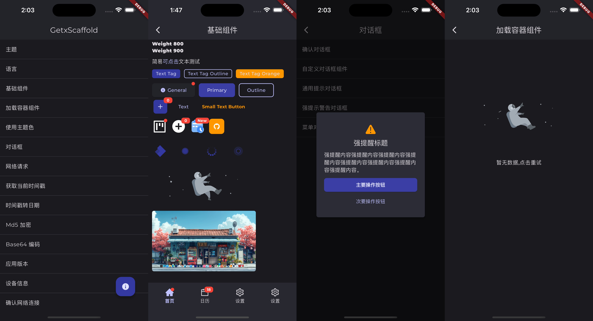

<h1 align="center"> GetX Scaffold</h1>

<div align="center">

Rapid development of scaffolding based on getx


<a href="https://github.com/Kxmrg/flutter_getx_scaffold"></a>

</div>

<div align="center">

[简体中文](./README.md) | English



</div>

## About GetX Scaffold

GetXScaffold is a rapid development scaffold built on the GetX framework and several commonly used plugins. It comprises a complete template for fast development, including globally accessible methods for common functionalities, useful extension methods, various utility classes, encapsulated components, easy-to-use dialogs, Dio network request tools with secondary encapsulation, GetxController with secondary encapsulation, application themes with secondary encapsulation, and internationalization implementation.GetXScaffold overly encapsulates the aforementioned content, including extension methods for some components that may deviate from Flutter's own development standards and alter your development habits. Therefore, this scaffold is purely aimed at improving development efficiency, reducing redundant code, and lowering development costs. If you are new to Flutter development and still in the learning phase, it is not recommended to use this scaffold. Below are just examples of some functionalities; it is advisable to explore all usage methods through sample projects or source code.

## Flutter Version

| Version | Flutter Version |
| ------- | ------------ |
| 0.0.3   | 3.19.5       |
| 0.0.4   | 3.22.2       |
| 0.1.2   | 3.24.0       |

## Run example

```
cd example
flutter pub get
flutter run

# If prompted with Error: Type 'UnimodiableUint8ListView' not found. Please update the win32 library

flutter pub upgrade win32

```

## Quick Start

#### 1. Add Dependencies

Add the following dependencies to the pubspec.yaml file in the Flutter project:

```dart
dependencies:
  getx_scaffold: ^0.0.1

  # If your project needs internationalization, please add the following dependency.
  flutter_localizations:
    sdk: flutter
```

#### 2. Initialize Scaffold

Initialize GetXScaffold in main.dart:

```dart
import 'package:getx_scaffold/getx_scaffold.dart';

void main() async {
  WidgetsBinding widgetsBinding = await init(
    isDebug: kDebugMode,
    logTag: 'GetxScaffold',
    supportedLocales: TranslationLibrary.supportedLocales,
  );
  runApp(
    GetxApp(
      // 设计稿尺寸 单位：dp
      designSize: const Size(390, 844),
      // Getx Log
      enableLog: kDebugMode,
      // 默认的跳转动画
      defaultTransition: Transition.rightToLeft,
      // 主题模式
      themeMode: GlobalService.to.themeMode,
      // 主题
      theme: AppTheme.light,
      // Dark主题
      darkTheme: AppTheme.dark,
      // 国际化配置
      locale: GlobalService.to.locale,
      translations: TranslationLibrary(),
      fallbackLocale: TranslationLibrary.fallbackLocale,
      supportedLocales: TranslationLibrary.supportedLocales,
      localizationsDelegates: TranslationLibrary.localizationsDelegates,
      // AppTitle
      title: 'GetxScaffold',
      // 首页
      home: const HomePage(),
      // Builder
      builder: (context, widget) {
        // do something....

        return widget!;
      },
    ),
  );
}
```

GetxApp nests GetMaterialApp with ScreenUtilInit for global screen adaptation. Through GlobalService, it facilitates seamless switching between multiple themes and languages.

#### 3. Define themes

```dart
import 'package:flutter/material.dart';

class AppTheme {
  static const String fontMontserrat = 'Montserrat';

  static const Color themeColor = Color.fromARGB(255, 11, 107, 47);

  static const Color darkThemeColor = Color.fromARGB(255, 27, 31, 139);

  /// 亮色主题样式
  static ThemeData light = ThemeData(
    colorScheme: ColorScheme.fromSeed(
      seedColor: themeColor,
      brightness: Brightness.light,
    ),
    fontFamily: fontMontserrat,
    cardTheme: CardTheme(
      surfaceTintColor: Colors.white,
      shape: RoundedRectangleBorder(
        borderRadius: BorderRadius.circular(6),
      ),
    ),
  );

  /// 暗色主题样式
  static ThemeData dark = ThemeData(
    colorScheme: ColorScheme.fromSeed(
      seedColor: darkThemeColor,
      brightness: Brightness.dark,
    ),
    fontFamily: fontMontserrat,
    cardTheme: CardTheme(
      shape: RoundedRectangleBorder(
        borderRadius: BorderRadius.circular(6),
      ),
    ),
  );
}
```

The above is an example of themes. All built-in components of GetXScaffold follow the Material3 design guidelines. If you define the theme colors using colorScheme, you can use all theme colors through the following methods:

```dart
ThemeColor.onPrimary
ThemeColor.onSecondary
ThemeColor.onSurface
......
```

#### 4. Internationalization

To further simplify internationalization implementation with GetXScaffold, you need to create TranslationLibrary and implement the following methods:

```dart
import 'package:flutter_localizations/flutter_localizations.dart';
import 'package:getx_scaffold/getx_scaffold.dart';

import 'locales/locale_en.dart';
import 'locales/locale_es.dart';
import 'locales/locale_zh.dart';

class TranslationLibrary extends Translations {
  // 默认语言 Locale(语言代码, 国家代码)
  static const fallbackLocale = Locale('zh', 'CN');

  static const supportedLocales = [
    Locale('zh', 'CN'),
    Locale('en', 'US'),
    Locale('es', 'ES'),
  ];

  @override
  Map<String, Map<String, String>> get keys => {
        'zh': zh,
        'en': en,
        'es': es,
      };

  static const localizationsDelegates = [
    GlobalMaterialLocalizations.delegate,
    GlobalWidgetsLocalizations.delegate,
    GlobalCupertinoLocalizations.delegate,
  ];
}
```

Add the following code to main.dart in the GetX App:

```dart
// 国际化配置
locale: GlobalService.to.locale,
translations: TranslationLibrary(),
fallbackLocale: TranslationLibrary.fallbackLocale,
supportedLocales: TranslationLibrary.supportedLocales,
localizationsDelegates: TranslationLibrary.localizationsDelegates,
```

#### 5. Add Page

All pages in GetXScaffold adopt the development approach of separating views and logic using GetView with GetxController. Note that all GetxControllers must mix in BaseControllerMixin to respond to global refresh.

##### HomePage.dart

```dart
import 'package:flutter/material.dart';
import 'package:example/common/langs/index.dart';
import 'package:getx_scaffold/getx_scaffold.dart';

import 'index.dart';

class HomePage extends GetView<HomeController> {
  const HomePage({super.key});

  // 主视图
  Widget _buildView() {
    return <Widget>[
      ListTile(
        title: Text(TextKey.zhuTi.tr),
        onTap: () {
          Get.to(() => const ThemePage());
        },
      ),
      ListTile(
        title: Text(TextKey.yuYan.tr),
        onTap: () {
          Get.to(() => const LanguagePage());
        },
      ),
    ]
        .toListView(
          separator: const DividerX(),
        )
        .scrollbar()
        .safeArea();
  }

  Widget _buildFloatingActionButton() {
    return FloatingActionButton(
      onPressed: () {},
      child: const Icon(Icons.info),
    ).padding(all: 20.w);
  }

  @override
  Widget build(BuildContext context) {
    return GetBuilder<HomeController>(
      init: HomeController(),
      //这里的id需要与HomeController中的builderId一致
      id: 'home',
      builder: (_) {
        //双击退出
        return DoublePressBackWidget(
          child: Scaffold(
            appBar: AppBar(
              title: const Text("GetxScaffold"),
              centerTitle: true,
              elevation: 1,
            ),
            floatingActionButton: _buildFloatingActionButton(),
            body: _buildView(),
          ),
        );
      },
    );
  }
}

```

##### HomeController.dart

```dart
import 'package:getx_scaffold/getx_scaffold.dart';

class HomeController extends GetxController with BaseControllerMixin {
  @override
  String get builderId => 'home';

  HomeController();

  @override
  void onInit() {
    super.onInit();

    //刷新ui
    updateUi();
    //返回
    back();
    //延时退出
    delayedBack();
  }

  /// 是否监听生命周期事件
  @override
  bool get listenLifecycleEvent => true;

  /// listenLifecycleEvent设置为true时，会调用以下生命周期方法
  @override
  void onDetached() {
    log('onDetached');
  }

  @override
  void onHidden() {
    log('onHidden');
  }

  @override
  void onInactive() {
    log('onInactive');
  }

  @override
  void onPaused() {
    log('onPaused');
  }

  @override
  void onResumed() {
    log('onResumed');
  }
}

```

## Global methods

```dart
/// 获取当前时间戳(Millisecond)
int getTimeStamp({bool isSecond = false})

/// 获取当前时间戳(Second)
int getTimeStampSecond()

/// 获取当前日期字符串
String getNowDateString()

/// 获取当前日期时间字符串
String getNowDateTimeString()

/// 获取当前时间字符串
String getNowTimeString()

/// 判断设备是否连接网络
Future<bool> isNetworkAvailable()

/// 判断设备是否连接移动网络
Future<bool> isConnectedToMobile()

/// 判断设备是否连接WiFi
Future<bool> isConnectedToWiFi()

/// 显示Toast
void showToast(String msg)

/// 显示成功Toast
void showSuccessToast(String msg)

/// 显示提示Toast
void showInfoToast(String msg)

/// 显示警告Toast
void showWarningToast(String msg)

/// 显示错误Toast
void showErrorToast(String msg)

/// 显示loading
void showLoading([String? msg])

/// 显示错误
void showError([String? msg])

/// 显示提示
void showInfo(String msg)

/// 隐藏loading
void dismissLoading()

/// 延时执行
void delayed(int milliseconds, Function() callback)

/// 监听事件总线
StreamSubscription<T> eventListen<T>(
  void Function(T)? onData, {
  Function? onError,
  void Function()? onDone,
  bool? cancelOnError,
})

/// 发送事件总线
sendEvent<T>(T event)

/// 刷新App所有页面
void refreshAppui()

/// 统一Log输出
void log(String log, [String? tag])

/// 切换主题模式
void changeThemeMode(ThemeMode themeMode)

/// 更改语言
void changeLanguage(Locale locale)

/// 打开网页
void openWebPage(String url, {LaunchMode mode = LaunchMode.platformDefault})

/// 拨打电话
void callPhone(String phoneNumber)

/**
 * 需要在App启动后调用
 */

/// 获取包信息
Future<PackageInfo> getPackageInfo()

/// 获取AppName
Future<String> getAppName()

/// 获取PackageName
Future<String> getPackageName()

/// 获取Version
Future<String> getVersion()

/// 获取BuildNumber
Future<String> getBuildNumber()

/// 获取设备信息
Future<BaseDeviceInfo> getDeviceInfo()

// 获取设备名称
Future<String?> getDeviceName()

// 获取系统版本
Future<String?> getDeviceSystemVersion()

/// 隐藏输入法
void hideKeyboard()

/// Change status bar Color and Brightness
Future<void> setStatusBarColor()

/// Dark Status Bar
void setDarkStatusBar()

/// Light Status Bar
void setLightStatusBar()

/// This function will show status bar
Future<void> showStatusBar()

// Enter FullScreen Mode (Hides Status Bar and Navigation Bar)
void enterFullScreen()

// Unset Full Screen to normal state (Now Status Bar and Navigation Bar Are Visible)
void exitFullScreen()

/// This function will hide status bar
Future<void> hideStatusBar()

/// Set orientation to portrait
void setOrientationPortrait()

/// Set orientation to landscape
void setOrientationLandscape()

/// SharedPreferences:

/// Add a value in SharedPref based on their type - Must be a String, int, bool, double, Map<String, dynamic> or StringList
Future<bool> setValue(String key, dynamic value, {bool print = true})

/// Returns List of Keys that matches with given Key
List<String> getMatchingSharedPrefKeys(String key)

/// Returns a StringList if exists in SharedPref
List<String>? getStringListAsync(String key)

/// Returns a Bool if exists in SharedPref
bool getBoolAsync(String key, {bool defaultValue = false})

/// Returns a Double if exists in SharedPref
double getDoubleAsync(String key, {double defaultValue = 0.0})

/// Returns a Int if exists in SharedPref
int getIntAsync(String key, {int defaultValue = 0})

/// Returns a String if exists in SharedPref
String getStringAsync(String key, {String defaultValue = ''}) 

/// Returns a JSON if exists in SharedPref
Map<String, dynamic> getJSONAsync(String key,{Map<String, dynamic>? defaultValue})

/// remove key from SharedPref
Future<bool> removeKey(String key)

/// clear SharedPref
Future<bool> clearSharedPref()

/// 申请权限
Future<bool> requestPermission({
  required Permission permission,
  String? title,
  String? confirmText,
  required String message,
  required String error,
})

/// 申请相机权限
Future<bool> requestCameraPermission()

/// 申请相册权限
Future<bool> requestPhotosPermission()

/// 申请蓝牙权限
Future<bool> requestBluetoothPermission()

```

## Extension methods

#### String? Extension：

```dart
/// 是否为空或null
bool get isEmptyOrNull => _isEmptyOrNull();

/// 是否不为空或null
bool get isNotEmptyOrNull => !_isEmptyOrNull();

/// 格式化时间字符串
String? dateFormat(String pattern)

/// 格式化时间字符串为日期
String? toDateString()

/// 格式化时间字符串为日期时间
String? toDateTimeString()

/// 格式化时间字符串为时间
String? toTimeString()

/// 获取DateTime对象
DateTime? getDateTime({bool? isUtc})

/// MD5加密
String? md5()

/// Base64编码
String? encodeBase64()

/// Base64解码
String? decodeBase64()

//转为金额字符串
String? toPrice(
int amount, {
MoneyFormats format = MoneyFormats.NORMAL,
MoneyUnit unit = MoneyUnit.NORMAL,
})

/// 转为int类型
int? toInt({int defValue = 0})

/// 转为double类型
double? toDouble({double defValue = 0})

/// 转为num类型
num? toNumber({num defValue = 0})

/// 判断是否为手机号(简易验证)
bool isMobileSimple()

/// 判断是否为手机号(严格验证)
bool isMobileExact()

/// 判断是否为座机号码
bool isTel()

/// 判断是否为身份证号码
bool isIDCard18()

/// 判断是否成年
bool isAdult()

/// 判断是否为Email
bool isEmail()

/// 判断是否为Url
bool isURL()

/// 判断是否为IP
bool isIP()

```

#### num? Extension：

```dart
/// 根据格式将时间戳(Milliseconds)格式化日期
String? dateFormat(String pattern, {bool isSecond = false})

/// 将时间戳(Milliseconds)格式化日期
String? toDateString({bool isSecond = false})

/// 将时间戳(Milliseconds)格式化日期时间
String? toDateTimeString({bool isSecond = false})

/// 将时间戳(Milliseconds)格式化时间
String? toTimeString({bool isSecond = false})

/// 将字节转为容量单位
String? toFileSize({int decimals = 0})

/// 时间戳(Milliseconds)距离当前的时间
String? getTimeDifference({bool isShowDay = true, bool isSecond = false})

/// 时间戳(Milliseconds)距离当前的时间描述
String? getTimeDifferenceDescription({bool isSecond = false})

/// 转为金额字符串
String? toPrice(
int amount, {
MoneyFormats format = MoneyFormats.NORMAL,
MoneyUnit unit = MoneyUnit.NORMAL,
})

/// 加 (精确相加,防止精度丢失).
/// add (without loosing precision).
double? add(num value)

/// 减 (精确相减,防止精度丢失).
/// subtract (without loosing precision).
double? subtract(num value)

/// 乘 (精确相乘,防止精度丢失).
/// multiply (without loosing precision).
double? multiply(num value)

/// 除 (精确相除,防止精度丢失).
/// divide (without loosing precision).
double? divide(num value)

/// 间距
Widget spacing()

```

#### List<Widget> Extension

```dart
/// 转 Wrap
Widget toWrap();

/// 转 Column
Widget toColumn();

/// 转 Row
Widget toRow();

/// 转 ListView
Widget toListView()

// 转 Stack
Widget toStack();

// 使用示例：
Widget _buildView() {
    return <Widget>[
        ListTile(
        title: Text(TextKey.genSuiXiTong.tr),
        trailing: GlobalService.to.themeMode == ThemeMode.system
            ? const Icon(Icons.check)
            : null,
        onTap: () {
            changeThemeMode(ThemeMode.system);
        },
        ),
        ListTile(
        title: Text(TextKey.liangSeZhuTi.tr),
        trailing: GlobalService.to.themeMode == ThemeMode.light
            ? const Icon(Icons.check)
            : null,
        onTap: () {
            changeThemeMode(ThemeMode.light);
        },
        ),
        ListTile(
        title: Text(TextKey.anSeZhuTi.tr),
        trailing: GlobalService.to.themeMode == ThemeMode.dark
            ? const Icon(Icons.check)
            : null,
        onTap: () {
            changeThemeMode(ThemeMode.dark);
        },
        ),
    ].toListView(
        separator: const DividerX(),
    );
}

```

#### Widget Extension：

```dart
/// 控制组件隐藏显示
Widget visibility();

/// 比例布局
Widget aspectRatio();

/// 卡片布局
Widget card();

/// 居中布局
Widget center();

/// 裁剪圆形
Widget clipOval();

/// 裁剪矩形
Widget clipRect();

/// 裁剪圆角
Widget clipRRect();

/// 阴影
Widget elevation();

/// expand
Widget expand();

/// 缩放布局
Widget fittedBox();

/// 弹性布局
Widget flexible();

/// 百分比布局
Widget fractionallySizedBox();

/// 限制盒子 最大宽高
Widget limitedBox();

/// 偏移
Widget offstage();

/// 透明度
Widget opacity();

/// 溢出
Widget overflow();

/// Stack布局 位置
Widget positioned();

/// 墨水纹
Widget inkWell();

/// 涟漪
Widget ripple();

/// 比例缩放
Widget scale();

/// 滚动视图
Widget scrollable();

/// 滚动条
Widget scrollbar();

/// Transforms Matrix4
Widget transform();

/// Translate 变化位置
Widget translate();

/// 约束
Widget constrained();

/// 约束宽高
Widget tight();

/// 约束宽度
Widget width();

/// 约束高度
Widget height();

/// 取消父级约束
Widget unConstrained();

/// 安全区域
Widget safeArea();

/// 对齐
Widget align();

/// 对齐 上左边
Widget alignTopLeft();

/// 对齐 顶部居中
Widget alignTopCenter();

/// 对齐 上右边
Widget alignTopRight();

/// 对齐 左边
Widget alignCenterLeft();

/// 对齐 中间
Widget alignCenter();

/// 对齐 右边
Widget alignCenterRight();

/// 对齐 下左边
Widget alignBottomLeft();

/// 对齐 底部
Widget alignBottomCenter();

/// 对齐 下右边
Widget alignBottomRight();

/// 盒子装饰器
Widget decorated();

/// 背景颜色
Widget backgroundColor();

/// 边框
Widget border();

/// 阴影
Widget boxShadow();

/// 手势
Widget gestures();

/// 点击
Widget onTap();

/// 内间距
Widget padding();

/// Sliver 内间距
Widget sliverPadding();

/// 内间距 纵向
Widget sliverPaddingVertical(double val);

/// 内间距 横向
Widget sliverPaddingHorizontal(double val);

/// 内间距 上
Widget sliverPaddingTop(double val);

/// 内间距 下
Widget sliverPaddingBottom(double val);

/// 内间距 左
Widget sliverPaddingLeft(double val);

/// 内间距 右
Widget sliverPaddingRight(double val);

/// SliverToBoxAdapter
Widget sliver();

```

## Widgets

GetXScaffold is not a UI component library; it only encapsulates some of the most commonly used components and optimizes their usage. For other needs, please import additional component libraries as needed.

```dart
import 'package:example/common/langs/index.dart';
import 'package:flutter/material.dart';
import 'package:getx_scaffold/common/index.dart';
import 'package:getx_scaffold/getx_scaffold.dart';

import 'index.dart';

class BaseWidgetsPage extends GetView<BaseWidgetsController> {
  const BaseWidgetsPage({super.key});

  // 主视图
  Widget _buildView() {
    return <Widget>[
      TextX.displayLarge('DisplayLarge'),
      TextX.displayMedium('DisplayMedium'),
      TextX.displaySmall('DisplaySmall'),
      TextX.headlineLarge('HeadlineLarge'),
      TextX.headlineMedium('HeadlineMedium'),
      TextX.headlineSmall('HeadlineSmall'),
      TextX.titleLarge('TitleLarge'),
      TextX.titleMedium('TitleMedium'),
      TextX.titleSmall('TitleSmall'),
      TextX.bodyLarge('BodyLarge'),
      TextX.bodyMedium('BodyMedium'),
      TextX.bodySmall('BodySmall'),
      TextX.labelLarge('LabelLarge'),
      TextX.labelMedium('LabelMedium'),
      TextX.labelSmall('LabelSmall'),
      const TextX('Weight 100', weight: FontWeight.w100),
      const TextX('Weight 200', weight: FontWeight.w200),
      const TextX('Weight 300', weight: FontWeight.w300),
      const TextX('Weight 400', weight: FontWeight.w400),
      const TextX('Weight 500', weight: FontWeight.w500),
      const TextX('Weight 600', weight: FontWeight.w600),
      const TextX('Weight 700', weight: FontWeight.w700),
      const TextX('Weight 800', weight: FontWeight.w800),
      const TextX('Weight 900', weight: FontWeight.w900),
      //可点击文本
      RichTextX(children: [
        TextSpanItem(
          '简易',
        ),
        TextSpanItem('可点击', onTap: () {
          showInfoToast('onClick!');
        }),
        TextSpanItem(
          '文本测试',
        ),
      ]).padding(top: 10.w),
      //TextTag
      <Widget>[
        const TextTag('Text Tag'),
        const TextTag(
          'Text Tag Outline',
          outline: true,
        ),
        const TextTag(
          'Text Tag Orange',
          color: Colors.orange,
        ),
      ].toWrap(spacing: 10.w).padding(top: 10.w),
      //Button
      <Widget>[
        ButtonX(
          'General',
          dot: true,
          icon: Icons.info,
          onPressed: () {},
        ),
        ButtonX.primary(
          'Primary',
          onPressed: () {},
        ),
        ButtonX.outline(
          'Outline',
          onPressed: () {},
        ),
        ButtonX.icon(
          Icons.add,
          badge: controller.number.toString(),
          onPressed: () {
            controller.increment();
          },
        ),
        ButtonX.text(
          'Text',
          onPressed: () {},
        ),
        ButtonX.text(
          'Small Text Button',
          textColor: Colors.orange,
          textSize: 12.sp,
          textWeight: FontWeight.bold,
          minSize: Size.zero,
          innerPadding: EdgeInsets.symmetric(horizontal: 10.w, vertical: 5.h),
          borderRadius: 3.r,
          onPressed: () {},
        ),
      ].toWrap(spacing: 10.w).padding(top: 10.w),
      //Icon
      //Antd图标库：https://www.iconfont.cn/collections/detail?spm=a313x.collections_index.i1.d9df05512.40943a815QJHPE&cid=9402
      <Widget>[
        IconX.icon(
          AntdIcon.project,
          size: 40.sp,
          dot: controller.showDot,
        ).onTap(() {
          controller.updateDot();
        }),
        IconX.icon(
          Icons.add_circle_sharp,
          size: 40.sp,
          badge: controller.number.toString(),
        ).onTap(() {
          controller.increment();
        }),
        IconX.svg(
          'assets/svgs/icon1.svg',
          size: 40.sp,
          badge: 'New',
        ),
        IconX.image(
          'assets/icons/ic_launcher_adaptive_dark.png',
          size: 40.sp,
        ).backgroundColor(Colors.orange).clipRRect(all: 8.r),
      ].toWrap(spacing: 10.w).padding(top: 10.w),
      //SpinKit
      //https://pub-web.flutter-io.cn/packages/flutter_spinkit
      <Widget>[
        SpinKitFoldingCube(
          color: ThemeColor.primaryContainer,
          size: 22.sp,
        ).padding(all: 10.w),
        20.w.spacing(),
        SpinKitDoubleBounce(
          color: ThemeColor.primaryContainer,
          size: 30.sp,
        ).padding(all: 10.w),
        20.w.spacing(),
        SpinKitFadingCircle(
          color: ThemeColor.primaryContainer,
          size: 30.sp,
        ).padding(all: 10.w),
        20.w.spacing(),
        SpinKitRipple(
          color: ThemeColor.primaryContainer,
          size: 30.sp,
        ).padding(all: 10.w),
      ].toRow().padding(top: 20.w),
      //lottie
      //https://pub-web.flutter-io.cn/packages/lottie
      Lottie.asset(
        'assets/lottie/error.json',
        package: pluginPackageName,
        width: 0.7.sw,
      ).padding(top: 10.w),
      //image
      ImageX.url(
        'https://i0.hdslb.com/bfs/archive/ac72ae36271a6970f92b1de485e6ae6c9e4c1ebb.jpg',
        width: 0.7.sw,
        radius: 5.r,
      ).padding(top: 10.w),
    ]
        .toColumn(crossAxisAlignment: CrossAxisAlignment.start)
        .padding(all: 10.w, bottom: 50.w)
        .scrollable()
        .scrollbar()
        .width(1.sw);
  }

  //导航栏
  Widget _buildNavigationBar() {
    return NavigationX(
      currentIndex: controller.pageIndex, // 当前选中的tab索引
      onTap: (index) {
        controller.pageIndex = index;
        controller.updateUi();
      }, // 切换tab事件
      items: [
        NavigationItemModel(
          label: '首页',
          icon: AntdIcon.home,
          selectedIcon: AntdIcon.home_fill,
          dot: true,
        ),
        NavigationItemModel(
          label: '日历',
          icon: AntdIcon.calendar,
          selectedIcon: AntdIcon.calendar_fill,
          badge: '18',
        ),
        NavigationItemModel(
          label: '设置',
          icon: AntdIcon.setting,
          selectedIcon: AntdIcon.setting_fill,
        ),
        NavigationItemModel(
          label: '设置',
          icon: AntdIcon.setting,
          selectedIcon: AntdIcon.setting_fill,
        ),
      ],
    );
  }

  @override
  Widget build(BuildContext context) {
    return GetBuilder<BaseWidgetsController>(
      init: BaseWidgetsController(),
      id: 'baseWidgets',
      builder: (_) {
        return Scaffold(
          extendBody: false,
          resizeToAvoidBottomInset: false,
          appBar: AppBar(title: Text(TextKey.jiChuZuJian.tr), elevation: 1),
          bottomNavigationBar: _buildNavigationBar(),
          body: SafeArea(
            child: _buildView(),
          ),
        );
      },
    );
  }
}

```

#### LoadContainer

Built-in loading, network error, and empty data states, switched via controllers. Widgets for each state can be customized.

```dart
import 'package:example/common/langs/index.dart';
import 'package:flutter/material.dart';
import 'package:getx_scaffold/getx_scaffold.dart';

import 'index.dart';

class LoadContainerPage extends GetView<LoadContainerController> {
  const LoadContainerPage({super.key});

  // 主视图
  Widget _buildView() {
    return <Widget>[
      TextX.titleLarge('Page contents'),
      ButtonX(
        'Show Load Error',
        onPressed: () => controller.onError(),
      ).width(double.infinity).padding(top: 30.h, horizontal: 50.w),
      ButtonX(
        'Show Load Empty',
        onPressed: () => controller.onEmpty(),
      ).width(double.infinity).padding(top: 10.h, horizontal: 50.w),
    ].toColumn(mainAxisSize: MainAxisSize.min).center();
  }

  @override
  Widget build(BuildContext context) {
    return GetBuilder<LoadContainerController>(
      init: LoadContainerController(),
      id: 'loadContainer',
      builder: (_) {
        return Scaffold(
          appBar: AppBar(title: Text(TextKey.zhuTi.tr), elevation: 1),
          body: SafeArea(
            child: LoadContainer(
              controller: controller.loadController!,
              onReLoad: controller.onLoad,
              child: _buildView(),
            ),
          ),
        );
      },
    );
  }
}

```

```dart
import 'package:getx_scaffold/getx_scaffold.dart';

class LoadContainerController extends GetxController with BaseControllerMixin {
  @override
  String get builderId => 'loadContainer';

  LoadController? loadController = LoadController();

  @override
  void onInit() {
    super.onInit();
    onLoad();
  }

  @override
  void onClose() {
    super.onClose();
    loadController?.dispose();
    loadController = null;
  }

  void onLoad() {
    loadController?.loading();
    delayed(3000, () => loadController?.complete());
  }

  void onEmpty() {
    loadController?.loading();
    delayed(3000, () => loadController?.empty());
  }

  void onError() {
    loadController?.loading();
    delayed(3000, () => loadController?.error());
  }
}
```

#### AntdIcon

The scaffold includes the AntDesign icon library, which can be directly accessed using AntdIcon.xxx.[View All](https://www.iconfont.cn/collections/detail?spm=a313x.collections_index.i1.d9df05512.2f663a81stAHOv&cid=9402)

```dart
AntdIcon.home
AntdIcon.home_fill
......

```

#### Dialog

```dart
// 显示确认弹窗
DialogX.to.showConfirmDialog();

// 显示通知弹窗
DialogX.to.showNoticeDialog();

// 显示提示弹窗
DialogX.to.showPromptDialog();

// 显示菜单弹窗
DialogX.to.showMenuDialog();
```

## Utils

Integrated common_utils and nb_utils libraries' common utility classes, and supplemented RSAUtils and other utility classes.

1. DateUtil : Date conversion and formatted output.
2. EncryptUtil : XOR symmetric encryption/decryption, MD5 encryption, Base64 encoding/decoding.
3. JsonUtil : Simple encapsulation for converting JSON strings to objects.
4. JwtDecoder : JWT decoding.
5. LogUtil : Global log control
6. MoneyUtil : Accurate conversion, yuan to fen, fen to yuan, supporting formatted output.
7. NumUtil : Keep x decimal places, perform precise addition, subtraction, multiplication, and division to prevent loss of precision.
8. ObjectUtil : Check if an object is empty (String, List, Map), and check if two Lists are equal.
9. RegexUtil : Regular expression validation for phone numbers, ID cards, emails, and so on.
10. RSAUtils : RSA encryption, decryption, and signature verification.
11. TextUtil : Insert spaces every 4 digits in a bank card number, add commas every 3 digits, and hide phone numbers, etc.
12. TimelineUtil : Timeline。
13. TimerUtil : Countdown, scheduled tasks.

## 网络请求

GetXScaffold has encapsulated Dio for a more concise invocation method and comprehensive request logging. It is invoked through HttpService.

```dart
// 设置BaseURL
HttpService.to.setBaseUrl('https://api.vvhan.com');

// 设置Authorization
HttpService.to.setAuthorization('1234567890');
HttpService.to.clearAuthorization();

// 统一的响应处理，这里返null则正常通过，返回Error字符串则会拦截该请求并弹出错误提示。这里可以对403等错误进行处理。
HttpService.to.setOnResponseHandler(
    (response) async {
        try {
            var result = BaseModel.fromJson(response.data);
            if (result.success == true) {
            return null;
            } else {
            return '服务器异常';
            }
        } on Exception catch (e) {
            e.printInfo();
            return '服务器异常';
        }
    },
);
// 取消统一响应处理
HttpService.to.setOnResponseHandler(null);

// get请求
showLoading();
var response = await HttpService.to.get(
    '/api/wallpaper/acg?type=json',
);
if (response != null) {
    dismissLoading();
    var result = BaseModel.fromJson(response.data);
    showToast(result.url ?? '');
}

// 取消请求
HttpService.to.cancel();

```
